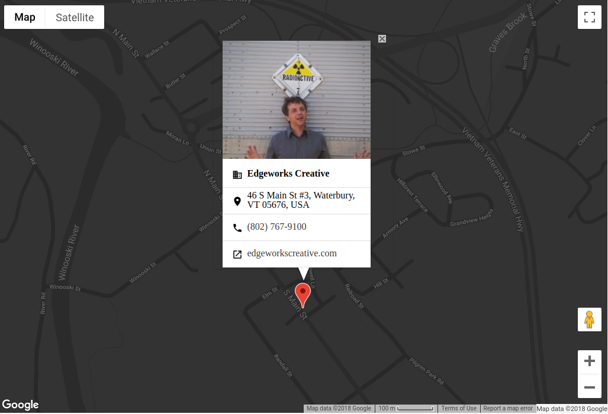

![Built With Stencil](https://img.shields.io/badge/-Built%20With%20Stencil-16161d.svg?logo=data%3Aimage%2Fsvg%2Bxml%3Bbase64%2CPD94bWwgdmVyc2lvbj0iMS4wIiBlbmNvZGluZz0idXRmLTgiPz4KPCEtLSBHZW5lcmF0b3I6IEFkb2JlIElsbHVzdHJhdG9yIDE5LjIuMSwgU1ZHIEV4cG9ydCBQbHVnLUluIC4gU1ZHIFZlcnNpb246IDYuMDAgQnVpbGQgMCkgIC0tPgo8c3ZnIHZlcnNpb249IjEuMSIgaWQ9IkxheWVyXzEiIHhtbG5zPSJodHRwOi8vd3d3LnczLm9yZy8yMDAwL3N2ZyIgeG1sbnM6eGxpbms9Imh0dHA6Ly93d3cudzMub3JnLzE5OTkveGxpbmsiIHg9IjBweCIgeT0iMHB4IgoJIHZpZXdCb3g9IjAgMCA1MTIgNTEyIiBzdHlsZT0iZW5hYmxlLWJhY2tncm91bmQ6bmV3IDAgMCA1MTIgNTEyOyIgeG1sOnNwYWNlPSJwcmVzZXJ2ZSI%2BCjxzdHlsZSB0eXBlPSJ0ZXh0L2NzcyI%2BCgkuc3Qwe2ZpbGw6I0ZGRkZGRjt9Cjwvc3R5bGU%2BCjxwYXRoIGNsYXNzPSJzdDAiIGQ9Ik00MjQuNywzNzMuOWMwLDM3LjYtNTUuMSw2OC42LTkyLjcsNjguNkgxODAuNGMtMzcuOSwwLTkyLjctMzAuNy05Mi43LTY4LjZ2LTMuNmgzMzYuOVYzNzMuOXoiLz4KPHBhdGggY2xhc3M9InN0MCIgZD0iTTQyNC43LDI5Mi4xSDE4MC40Yy0zNy42LDAtOTIuNy0zMS05Mi43LTY4LjZ2LTMuNkgzMzJjMzcuNiwwLDkyLjcsMzEsOTIuNyw2OC42VjI5Mi4xeiIvPgo8cGF0aCBjbGFzcz0ic3QwIiBkPSJNNDI0LjcsMTQxLjdIODcuN3YtMy42YzAtMzcuNiw1NC44LTY4LjYsOTIuNy02OC42SDMzMmMzNy45LDAsOTIuNywzMC43LDkyLjcsNjguNlYxNDEuN3oiLz4KPC9zdmc%2BCg%3D%3D&colorA=16161d&style=flat-square)

# Edgeworks Creative - Google Maps Component

Google Maps Place card web component built with StencilJS.

So simple, it works with only two lines of code! [JSFiddle](https://jsfiddle.net/v3a4urwL/1/)

###### WIP



#### Stencil components are just Web Components, so they work in any major framework or with no framework at all.

## Example

```html
<ewc-google-map 
  place-id="ChIJc0ONLheftUwR2eRUIlyCAF4" 
  zoom="16" 
  snazzy-map="https://snazzymaps.com/style/228639/dark-tan" 
  key="GOOGLE-MAPS-API-KEY"></ewc-google-map>
```

## Features
- Load styles directly from [SnazzyMaps](https://snazzymaps.com/) (Please cache this request in your service worker)
- Easily retrieve business contact information by passing your [Google Place](https://developers.google.com/places/web-service/intro) ID.
- Slide through all of your [Google Place](https://developers.google.com/places/web-service/intro) photos.

### FAQ
- How do I find my Google Place ID? 
  - You can use the map located [here](https://developers.google.com/places/place-id) to find your Place ID.
- Do I need a Google Maps API key?
  - You do not need a key when developing locally.
- Where do I find my Google Maps API key?
  - You can follow [these](https://developers.google.com/maps/documentation/javascript/get-api-key) steps.
- I'd like to use the SnazzyMaps feature, what should I add to my service worker?
  - If you're using Workbox: 
  ```javascript 
  workbox.routing.registerRoute(
    new RegExp('^https://cors-anywhere.herokuapp.com/https://snazzymaps.com/'),
    workbox.strategies.cacheFirst({
      cacheName: 'snazzy-maps',
      plugins: [
        new workbox.cacheableResponse.Plugin({
          statuses: [0, 200]
        }),
      ],
    }),
  );
  ```

## Using this component

### Script tag
- Put a script tag similar to this `<script src='https://unpkg.com/@edgeworkscreative/ewc-google-map@latest/dist/ewc.js'></script>` in the head of your index.html
- Then you can use the element anywhere in your template, JSX, html etc

### Node Modules
- Run `npm install @edgeworkscreative/ewc-google-map --save`
- Put a script tag similar to this `<script src='node_modules/@edgeworkscreative/ewc-google-map/dist/ewc.js'></script>` in the head of your index.html
- Then you can use the element anywhere in your template, JSX, html etc

### In a stencil-starter app
- Run `npm install @edgeworkscreative/ewc-google-map --save`
- Add an import to the npm packages `import '@edgeworkscreative/ewc-google-map';`
- Then you can use the element anywhere in your template, JSX, html etc

### TODO
- Documentation
- Add `styles` prop as alternative to fetching directly from SnazzyMaps

## Stencil

Stencil is a compiler for building fast web apps using Web Components.

Stencil combines the best concepts of the most popular frontend frameworks into a compile-time rather than run-time tool.  Stencil takes TypeScript, JSX, a tiny virtual DOM layer, efficient one-way data binding, an asynchronous rendering pipeline (similar to React Fiber), and lazy-loading out of the box, and generates 100% standards-based Web Components that run in any browser supporting the Custom Elements v1 spec.